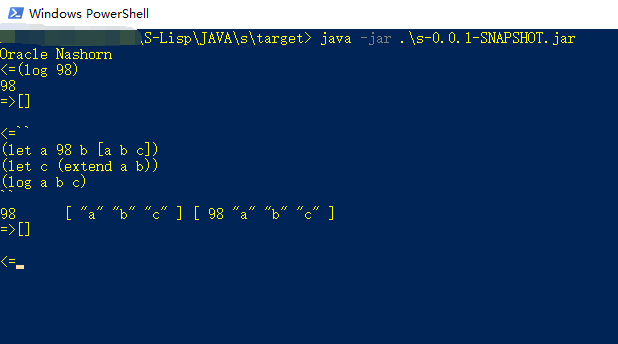

# Java版的S-Lisp
粗糙的实现

eclipse下的maven项目，用JS做桥，启动会比较慢，因为每次都要对js打包。

使用方法：最好将整个项目clone下来再打包（如果是eclipse，选择Open Projects form File System...)，因为依赖config文件夹在项目下（无法很好地打包进jar）在控制台下进入生成的target目录
1. 控制台交互：输入java -jar ./s-0.0.1-SNAPSHOT.jar 换行并输入``执行前面的语句

2. 执行文件，比如:java -jar ./s-0.0.1-SNAPSHOT.jar ../deom/x.lisp

实现得很粗糙，可能没达到你的预期，但Java实现简单很多，不用管理内存。

基础库是用js写的，在JAVA/s/config/js/util/s-lisp/library.js里面。扩展库(用S-Lisp实现)在JAVA/s/config/lisp/mb/index.lisp。你可以按自己的需要扩展，Java下的js调用Java类很容易，自己桥了一个到S-Lisp的库，可能没做好，~~暂时管不了了~~。但Java7及以前的Rhino引擎都很鸡肋，Java8的nashron终于能自由扩展Java类了，在做界面的时候经常不得不派生。

你可能看到我的js模块的写法，在util和act文件夹下，是以小括号包含一个大括号(字典或叫Object，我习惯叫字典)字典中success即是导出的函数，如果字典中有delay:true,则将success执行一遍，将执行结果作为导出函数。这是我曾经疲惫于AMD\CMD的模块加载研究的一种使用~~还比较自豪~~方式，本来只想用字典(像JSON一样)，但编辑器会报错，不得不用小括号。在前端支持ajax加载(目前不支持循环引用)，可以在请求回的txt前加上任意函数前缀(最初有个mb.ajax.require，后来严肃地取消了，再后来才发现这样取消不支持跨域，不支持就不支持吧)。字典中如果有data，则data字典则是加载的模块，目前已经支持相对路径（坏处就是不能通过文件遍历扫描到依赖）。但是实践结果前端ajax加载感觉很慢，后端因为读文件是同步的，而且为了查错方便通常会打包成一个文件（即看到生成的out.jsx），node.js中的各种异步让人头皮发麻，故已经切换为使用Java下的js，还能享有Java庞大的库。此外字典支持键扩展，比如我在做servlet桥到js的时候，增加了一个out键。

如你所见，模块中现内置了

* false
* true
* log
* reverse //翻转
* rest //返回列表头一个反面的，因为内部实现是链表
* first //返回列表头一个
* list //返回参数列表，和quote其实对应
* empty? //是否是空列表null
* exist? //和empty?相反
* list? //是否是列表
* function? //是否是函数
* length //每个列表节点都记录了长度，因为不会改变
* extend //(v,vs)类似于unshift但返回是一个新列表，旧列表不变
* quote //返回第一个参数
* parseInt //偶尔会用到
* join //感觉不常用
* kvs-find1st //(kvs,k)，因为kvs列表的键可能是重复的，像url中的query参数，所以只找第一个
* kvs-exntend //(k,v,kvs),其实就是两个extend组合，当初参数不是这个顺序，但这个顺序比较反映内部结构，然而通常v是临时定义的，会换行，则旧的kvs会不显眼。
* if //相当于C系语言中的a?b:c
* str-join //字符串拼接，比较常用
* toString
* stringify //和toString一样，与JSON.stringify对应，目前没想要用哪个名字，因为无循环引用，所以都可以序列化，包括函数，当然函数会丢失父作用域。
* \+
* \-
* \*
* /
* \>
* \<
* =
* and
* or
* not 
* Java_type //nashron中的Java.type
* Java_new //构造Java实例，一句话说不清，看实现
* Java_call //调用Java方法
* Java_attr //访问Java属性
* apply //类似js中apply
* cache //一个在gui编程中，可能会常用的函数
* parse //类似JSON.parse或eval，但第二个参数是kvs-map，作用域，如果不传，内部有默认值
* library //上面parse中参数2的默认值，自己可以进一步扩展。

扩展库中有

* !=
* empty-fun
* exist?
* default //参数1若为空，返回参数2
* forEach
* kvs-forEach
* if-run //模仿C系语言中的if
* switch 
* switch-run //模仿C系语言中的switch

对了，内置了load函数，相当于模块加载吧。

本来JS也想改成用load函数加载，但js必须显式地return，还得凑合用前面的方法来过。

今日深思，因为空列表[]内部实现就是null，故不用专门的null。

以上只是我目前用到的库，没有经过深思，比较粗糙。因为我觉得库是大工程，又可能比较个性，而S-Lisp的特长不在库，而是希望像JSON一样自由，每个人都能实现自己想要的东西。

希望大家能喜欢。也衷心希望能得到语言大师的帮助，使其羽翼丰满起来。