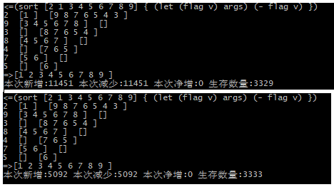

## C++内置优化


20180831优化
(reduce [a b c]
	{
		(let (init v i) args)
		(extend v init)
	}
	[]
)
525->原始
480->parse免反转
414->()[]缓存着r-children
未来可能对let表达式细化

比如sort
```lisp
(sort [2 1 3 4 5 6 7 8 9] { (let (flag v) args) (- flag v) })
```
内部实现使用了reduce(reduce-left)
将reduce使用C++实现前与实现后，消耗对比
 

通常，列表的遍历用reduce，reduce-right如果要用C++实现，似乎比较麻烦一点，不得不先reverse再reduce。而非列表（增长型）一般回到函数本身的递归，函数持有自身(this)，别名后供内部的lambda回调，没有尾递归优化（似乎也不好实现，因为每一层都是全新的函数）不知道能走多远。内部实现tokenize和parse将递归优化也了while语句（C++递归太多似乎会报错），但我已经习惯了递归思考。